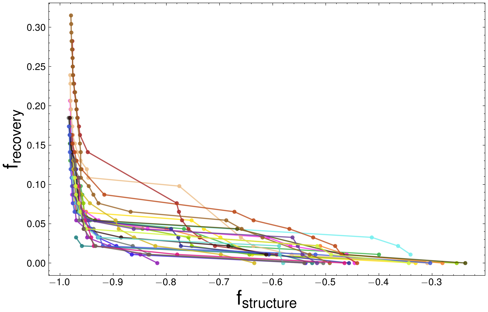
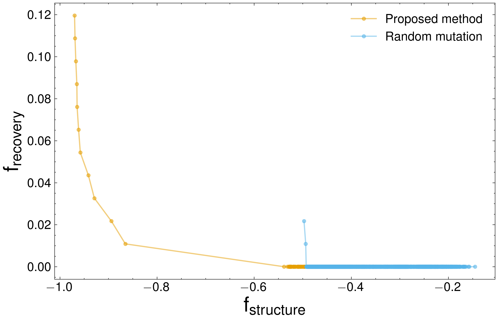

# Experiment and Plotting Codebase

[](https://doi.org/10.1080/27660400.2025.2611575)

This repository is the official implementation of the paper:
> **Multi-objective optimization for designing structurally similar proteins with dissimilar sequences** > Ryo Akiba, Yoshitaka Moriwaki, Ryuichiro Ishitani & Naruki Yoshikawa  
> *Science and Technology of Advanced Materials: Methods*, 2025.  
> [Read the paper here](https://doi.org/10.1080/27660400.2025.2611575)

---

## 📁 Directory Structure

```
.
├── experiment_code/        # Main experiment package
│   ├── main.py             # Entry point for experiments
│   ├── script.sh           # Shell script to run experiments
│   ├── config.yaml         # Configuration file
│   ├── requirements.txt    # Required Python packages
│   ├── protein_mpnn/       # ProteinMPNN integration utilities
│   ├── nsga_ii/            # NSGA-II algorithm (mutation, generation replacement, etc.)
│   └── evaluation_functions/
│       ├── plddt/          # Evaluation: pLDDT scores
│       ├── tmscore/        # Evaluation: TM-scores
│       └── recovery/       # Evaluation: Recovery metrics
│
├── plot-code/              # Plot generation scripts
│   ├── fig1.py
│   ├── ...
│   └── fig7.py  
│
├── plot/                   # Generated plots
│   ├── fig1.png
│   ├── fig3.png
│   ├── fig4_seed24.png
│   └── fig7/               
│       ├── fig4_seed01.png
│       ├── ...
│       └── fig4_seed24.png
│
└── data/                   # Data generated or used in experiments
    ├── pMPNN_data
    │   ├── output_mpnn_03.csv
    │   ├── output_mpnn_07.csv
    │   ├── output_mpnn_10.csv
    │   ├── output_mpnn_20.csv
    │   └── output_mpnn_30.csv
    ├── random_mutation_data
    │   └── results.csv
    ├── reference_data
    │   └── req_seq.csv
    ├── seed01.csv
    ├── ...
    └── seed24.csv
```

---

## 🚀 Running Experiments

To set up the environment and synchronize dependencies:

```shell
cd experiment_code
uv sync
```

Make sure to install [USalign](https://github.com/pylelab/USalign) and specify its path in `config.yaml`.
Download the [ProteinMPNN](https://github.com/dauparas/ProteinMPNN?tab=readme-ov-file) model weights and set their path in `config.yaml`. The experiment uses `v_48_020.pt` .


To run the experiments, execute:

```shell
cd experiment_code
bash script.sh
```

---

## 📊 Plotting Figures

### Figure 2


```shell
python plot-code/fig2.py
```

---

### Figure 3


```shell
python plot-code/fig3.py
```

---

### Figure 4


```shell
python plot-code/fig4.py
```

### Figure 5



```shell
python plot-code/fig5.py
```

### Figure 6



```shell
python plot-code/fig6.py
```

### Figure 7


```shell
python plot-code/fig7.py
```

## Citation

If you use this code or our methodology in your research, please cite our paper:

```bibtex
@article{Akiba2025,
  title={Multi-objective optimization for designing structurally similar proteins with dissimilar sequences},
  author={Akiba, Ryo and Moriwaki, Yoshitaka and Ishitani, Ryuichiro and Yoshikawa, Naruki},
  journal={Science and Technology of Advanced Materials: Methods},
  year={2025},
  doi={10.1080/27660400.2025.2611575},
  url={https://doi.org/10.1080/27660400.2025.2611575}
}