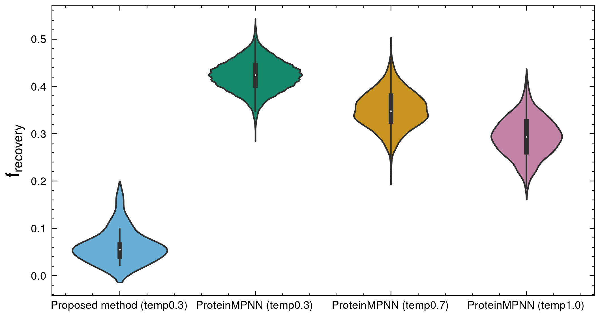
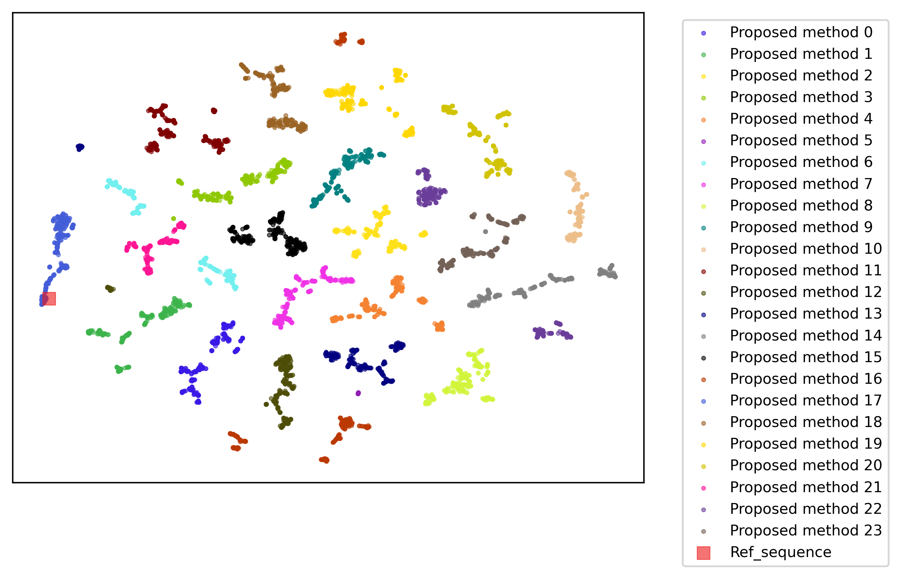

# Experiment and Plotting Codebase

This repository contains code for running experiments and generating visualizations for protein sequence optimization using NSGA-II and ProteinMPNN.

---

## 📁 Directory Structure

```
.
├── experiment_code/        # Main experiment package
│   ├── main.py             # Entry point for experiments
│   ├── script.sh           # Shell script to run experiments
│   ├── config.yaml         # Configuration file
│   ├── requirements.txt    # Required Python packages
│   ├── protein_mpnn/       # ProteinMPNN integration utilities
│   ├── nsga_ii/            # NSGA-II algorithm (mutation, generation replacement, etc.)
│   └── evaluation_functions/
│       ├── plddt/          # Evaluation: pLDDT scores
│       ├── tmscore/        # Evaluation: TM-scores
│       └── recovery/       # Evaluation: Recovery metrics
│
├── plot-code/              # Plot generation scripts
│   ├── fig1.py
│   ├── fig2.py             # Sequence Similarity Network plot
│   ├── fig3.py
│   └── fig4.py  
│
├── plot/                   # Generated plots
│   ├── fig1.png
│   ├── fig3.png
│   ├── fig4_seed24.png
│   └── fig4/               # Per-seed visualizations
│       ├── fig4_seed01.png
│       ├── ...
│       └── fig4_seed24.png
│
└── data/                   # Data generated or used in experiments
    ├── pMPNN_data
    │   ├── output_mpnn_03.csv
    │   ├── output_mpnn_07.csv
    │   ├── output_mpnn_10.csv
    │   ├── output_mpnn_20.csv
    │   └── output_mpnn_30.csv
    ├── random_mutation_data
    │   └── results.csv
    ├── reference_data
    │   └── req_seq.csv
    ├── seed01.csv
    ├── ...
    └── seed24.csv
```

---

## 🚀 Running Experiments

To run the experiments:

```bash
cd experiment_code
bash script.sh
```

Or manually via:

```bash
python main.py
```

Dependencies are listed in:

```text
experiment_code/requirements.txt
```

---

## 📊 Plotting Figures

### Fig 1



```bash
python plot-code/fig1.py
```

---

### Fig 2: Sequence Similarity Network (SSN)



```bash
python plot-code/SSN.py
```

---

### Fig 3


```bash
python plot-code/fig3.py
```

---

### Fig 4 (Seed 24 example)


```bash
python plot-code/fig4.py
```

> Plots for all seeds are saved in `plot/fig4/`.

## expriment_code/main.py
for setting up environment variables and paths
```bash
chmod +x setup.sh
. setup.sh
```